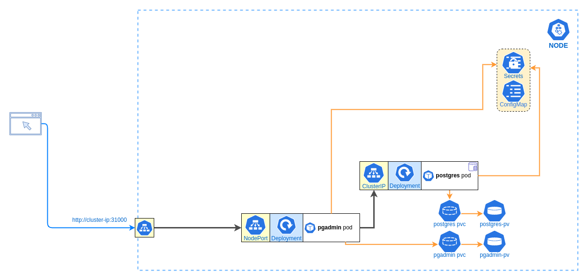

# AudioGEEK

## K8S deployment



### File structure

- `namespace.yml` - contains namspace definition used in all K8S Objects
- `pvc` - directory containing all Persisted Volumes Claims definitions used by Deplyments
- `services` - directory containing deployments for infrastructure services: PostgreSQL and PGAdmin

### How to deploy

```
kubectl apply -f namespace.yml
kubectl apply -f pvc
kubectl apply -f services
```